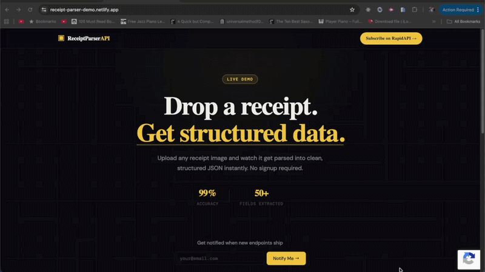

# Receipt / Invoice Parser API

Convert receipt & invoice images to structured JSON — try the live demo, no signup required
[▶ Try Live Demo](https://receipt-parser-demo.netlify.app/)

Built with **FastAPI** and **Claude Vision API**.



[See code examples in 10+ languages on RapidAPI](https://rapidapi.com/vernonroque/api/receipt-parser2/playground/apiendpoint_2a52b603-6f41-4a2d-bc24-742f30a3acaa)

---

## Features

- 📄 Parses JPEG, PNG, WEBP images and multi-page PDFs
- 🧠 Claude vision model extracts merchant, line items, totals, tax, tip, currency
- 🔐 Static API key authentication via `Authorization: Bearer` header
- 🚀 Deploy-ready for Railway (poppler included via nixpacks)

---

## Project Structure

```
receipt-parser/
├── app/
│   ├── main.py                  # FastAPI app + middleware setup
│   ├── api/
│   │   └── parse.py             # POST /api/parse — main upload endpoint
│   ├── core/
│   │   └── config.py            # Environment variable settings
│   ├── models/
│   │   └── schemas.py           # Pydantic models (ParsedReceipt, etc.)
│   └── services/
│       ├── auth_middleware.py   # Static API key validation
│       ├── parser_service.py    # Claude vision extraction + JSON merging
│       └── pdf_service.py       # PDF → image conversion via pdf2image
├── tests/
│   └── test_api.py              # Pytest test suite
├── .env.example                 # Copy to .env and fill in values
├── requirements.txt
├── railway.toml                 # Railway deployment config
└── nixpacks.toml                # Installs poppler on Railway
```

---

## Quickstart

### 1. Clone and install dependencies

```bash
git clone <your-repo>
cd receipt-parser

# Install poppler (required for PDF support)
# macOS:
brew install poppler
# Ubuntu/Debian:
sudo apt-get install -y poppler-utils
# Windows: download from https://github.com/oschwartz10612/poppler-windows

python -m venv venv
source venv/bin/activate        # Windows: venv\Scripts\activate
pip install -r requirements.txt
```

### 2. Configure environment variables

```bash
cp .env.example .env
# Edit .env — set ANTHROPIC_API_KEY and generate an API_KEY:
python -c "import secrets; print(secrets.token_urlsafe(32))"
```

### 3. Run locally

```bash
uvicorn app.main:app --reload
```

API is now running at `http://localhost:8000`
Interactive docs at `http://localhost:8000/docs`

---

## API Reference

### Authentication

All endpoints (except `/health`) require:

```
Authorization: Bearer <your-api-key>
```

The API key is the value you set in `API_KEY` in your `.env` file.

---

### `POST /api/parse`

Upload a receipt or invoice image/PDF. Returns structured JSON.

**Request:**
```
Content-Type: multipart/form-data
Authorization: Bearer <api-key>

file: <image or PDF file>
```

**Supported file types:** `image/jpeg`, `image/png`, `image/webp`, `application/pdf`
**Max file size:** 10MB
**Max PDF pages:** 10

**Response:**
```json
{
  "success": true,
  "pages_processed": 1,
  "data": {
    "merchant": {
      "name": "Whole Foods Market",
      "address": "1234 Main St, Austin TX 78701",
      "phone": "512-555-0100",
      "website": null,
      "tax_id": null
    },
    "date": "2024-11-15",
    "invoice_number": null,
    "line_items": [
      { "description": "Organic Bananas", "quantity": 1.2, "unit_price": 0.69, "total": 0.83 },
      { "description": "Almond Milk 64oz", "quantity": 2, "unit_price": 4.99, "total": 9.98 }
    ],
    "subtotal": 10.81,
    "tax": 0.89,
    "tip": null,
    "discount": null,
    "total": 11.70,
    "currency": "USD",
    "payment_method": "Visa ending 4242",
    "notes": null
  }
}
```

---

## Running Tests

```bash
pytest tests/ -v
```

---

## Deploying to Railway

1. Push your code to GitHub
2. Create a new Railway project → **Deploy from GitHub repo**
3. Add environment variables in Railway dashboard (same as your `.env`)
4. Railway will automatically use the `Dockerfile` to install `poppler-utils`
5. Your API will be live at `https://your-app.up.railway.app`

> **Tip:** Railway's free tier is enough for early testing. Upgrade when you need always-on uptime.

---

## Adding PDF Support on Render

If you deploy to Render instead of Railway, add this to your `render.yaml`:

```yaml
buildCommand: "apt-get install -y poppler-utils && pip install -r requirements.txt"
```

---

## License

MIT
